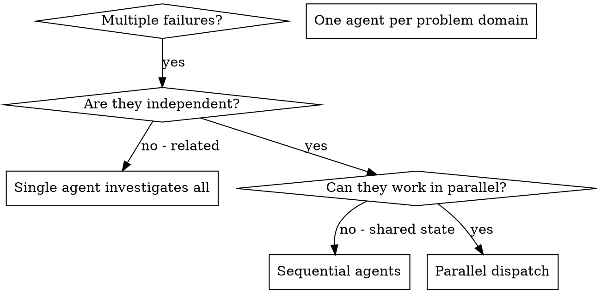

# Dispatching Parallel Agents

## Overview

You delegate tasks to specialized agents with isolated context. By precisely crafting their instructions and context, you ensure they stay focused and succeed at their task. They should never inherit your session's context or history — you construct exactly what they need. This also preserves your own context for coordination work.

When you have multiple unrelated failures (different test files, different subsystems, different bugs), investigating them sequentially wastes time. Each investigation is independent and can happen in parallel.

**Core principle:** Dispatch one agent per independent problem domain. Let them work concurrently.

## When to Use



**Use when:**
- 3+ test files failing with different root causes
- Multiple subsystems broken independently
- Each problem can be understood without context from others
- No shared state between investigations

**Don't use when:**
- Failures are related (fix one might fix others)
- Need to understand full system state
- Agents would edit the same files or use the same non-versioned resources

## The Pattern

### 1. Identify Independent Domains

Group failures by what's broken:
- File A tests: Tool approval flow
- File B tests: Batch completion behavior
- File C tests: Abort functionality

Each domain is independent - fixing tool approval doesn't affect abort tests.

### 2. Create Focused Agent Tasks

Each agent gets:
- **Specific scope:** One test file or subsystem
- **Clear goal:** Make these tests pass
- **Constraints:** Don't change other code
- **Expected output:** Summary of what you found and fixed, plus the jj change ID for edits

For write-capable agents, create one jj workspace per agent from the same base
change. **Never dispatch multiple write-capable agents into the same workspace.**
Use a run-scoped namespace for every workspace name and put the workspace paths
under `$(jj workspace root)/.tmp`. First verify that repository ignore rules
exclude `.tmp/`, as required by superpowers:using-jj-workspaces. If no Jujutsu
repository exists, isolated Jujutsu workspaces cannot be created; use `.tmp` in
the current directory only for local temporary artifacts, report the missing
repository, and do not dispatch write-capable agents as if they were isolated:

```bash
root=$(jj workspace root) || exit 1
base=$(jj log -r @ --no-graph -T 'change_id ++ "\n"')
run_root="$root/.tmp/parallel-agents-$(date +%s)-$$"
mkdir -p "$run_root"
namespace=$(basename "$run_root")

jj workspace add --name "$namespace-agent-1" -r "$base" "$run_root/agent-1"
jj workspace add --name "$namespace-agent-2" -r "$base" "$run_root/agent-2"
jj workspace add --name "$namespace-agent-3" -r "$base" "$run_root/agent-3"
```

Give each agent only its own workspace path and name. Read-only investigations
need no extra workspace.

### 3. Dispatch in Parallel

Issue all three subagent dispatches in the same response — they run in parallel:

```text
Subagent (general-purpose): "In <agent-1-path>, fix agent-tool-abort.test.ts failures"
Subagent (general-purpose): "In <agent-2-path>, fix batch-completion-behavior.test.ts failures"
Subagent (general-purpose): "In <agent-3-path>, fix tool-approval-race-conditions.test.ts failures"
# All three run concurrently.
```

Multiple dispatch calls in one response = parallel execution. One per response = sequential.

### 4. Review and Integrate

When agents return:
- Read each summary
- Inspect each reported change with `jj show <change-id>`
- Combine the independent changes with `jj new <change-id-1> <change-id-2> ...`
- Resolve any conflicts in the combined change
- Run full test suite
- Forget each temporary workspace with `jj workspace forget <workspace-name>`, then remove its directory

## Agent Prompt Structure

Good agent prompts are:
1. **Focused** - One clear problem domain
2. **Self-contained** - All context needed to understand the problem
3. **Specific about output** - What should the agent return?

```markdown
Fix the 3 failing tests in src/agents/agent-tool-abort.test.ts:

1. "should abort tool with partial output capture" - expects 'interrupted at' in message
2. "should handle mixed completed and aborted tools" - fast tool aborted instead of completed
3. "should properly track pendingToolCount" - expects 3 results but gets 0

These are timing/race condition issues. Your task:

1. Read the test file and understand what each test verifies
2. Identify root cause - timing issues or actual bugs?
3. Fix by:
   - Replacing arbitrary timeouts with event-based waiting
   - Fixing bugs in abort implementation if found
   - Adjusting test expectations if testing changed behavior

Do NOT just increase timeouts - find the real issue.

Before returning, inspect repository-local instructions and recent `jj log` descriptions, then describe your change in that repository-local style with `jj describe`. Repository-local instructions and syntax observed in `jj log` take precedence over compatible Go guidance.

Based on https://go.dev/wiki/CommitMessage and on past commit messages that you can see in `git log`, compose commit messages adherent to the present standards.

Apply only compatible Go guidance, such as clarity and useful rationale. Do not impose a fixed message, prefix, type, scope, subject, body, template, or example. Use `[change description]` as a neutral command placeholder. Do not add agent attribution.

Return: Summary of what you found and what you fixed, plus the jj change ID from
`jj log -r @ --no-graph -T 'change_id ++ "\n"'`.
```

## Common Mistakes

**❌ Too broad:** "Fix all the tests" - agent gets lost
**✅ Specific:** "Fix agent-tool-abort.test.ts" - focused scope

**❌ No context:** "Fix the race condition" - agent doesn't know where
**✅ Context:** Paste the error messages and test names

**❌ No constraints:** Agent might refactor everything
**✅ Constraints:** "Do NOT change production code" or "Fix tests only"

**❌ Vague output:** "Fix it" - you don't know what changed
**✅ Specific:** "Return summary of root cause, changes, and jj change ID"

**❌ Shared workspace:** Parallel agents overwrite or absorb each other's edits
**✅ Isolated workspaces:** One uniquely named temporary jj workspace per writer

## When NOT to Use

**Related failures:** Fixing one might fix others - investigate together first
**Need full context:** Understanding requires seeing entire system
**Exploratory debugging:** You don't know what's broken yet
**Shared state:** Agents would interfere (editing same files, using the same non-versioned resources)

## Example

**Scenario:** 6 test failures across 3 files after major refactoring

**Failures:**
- agent-tool-abort.test.ts: 3 failures (timing issues)
- batch-completion-behavior.test.ts: 2 failures (tools not executing)
- tool-approval-race-conditions.test.ts: 1 failure (execution count = 0)

**Decision:** Independent domains - abort logic separate from batch completion separate from race conditions

**Dispatch:**
```
Agent 1 → Fix agent-tool-abort.test.ts
Agent 2 → Fix batch-completion-behavior.test.ts
Agent 3 → Fix tool-approval-race-conditions.test.ts
```

**Results:**
- Agent 1: Replaced timeouts with event-based waiting
- Agent 2: Fixed event structure bug (threadId in wrong place)
- Agent 3: Added wait for async tool execution to complete

**Integration:** All fixes independent, no conflicts, full suite green

## Verification

After agents return:
1. **Review each summary** - Understand what changed
2. **Check for conflicts** - Did agents edit same code?
3. **Run full suite** - Verify all fixes work together
4. **Spot check** - Agents can make systematic errors
