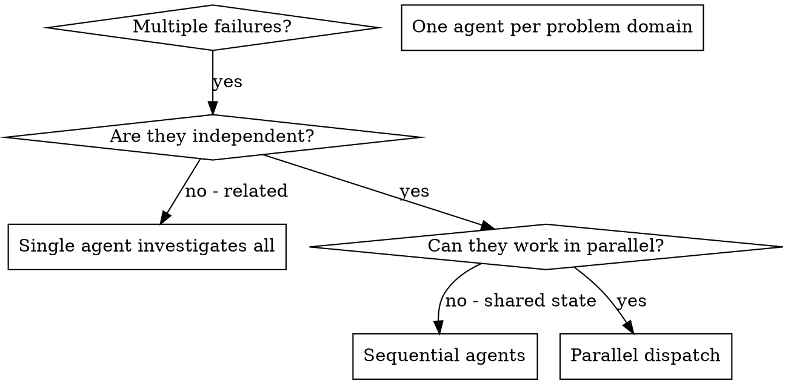

# Dispatching Parallel Agents

## Overview

You delegate tasks to specialized agents with isolated context and, when they edit files, isolated Jujutsu workspaces. By precisely crafting their instructions and context, you ensure they stay focused and succeed at their task. They should never inherit your session's context or history — you construct exactly what they need. This also preserves your own context for coordination work.

When you have multiple unrelated failures (different test files, different subsystems, different bugs), investigating them sequentially wastes time. Each investigation is independent and can happen in parallel.

**Core principle:** Dispatch one agent per independent problem domain. Let them work concurrently.

## When to Use



**Use when:**
- 3+ test files failing with different root causes
- Multiple subsystems broken independently
- Each problem can be understood without context from others
- No shared state or working copy between investigations

**Don't use when:**
- Failures are related (fix one might fix others)
- Need to understand full system state
- Agents would interfere with each other

## The Pattern

### 1. Identify Independent Domains

Group failures by what's broken:
- File A tests: Tool approval flow
- File B tests: Batch completion behavior
- File C tests: Abort functionality

Each domain is independent - fixing tool approval doesn't affect abort tests.

### 2. Create Focused Agent Tasks

Each agent gets:
- **Specific scope:** One test file or subsystem
- **Clear goal:** Make these tests pass
- **Constraints:** Don't change other code; follow repository instructions and conventions
- **Workspace:** A dedicated Jujutsu workspace when editing files
- **Expected output:** Summary of what you found and fixed, plus the resulting change ID

Create one workspace per editing agent. First verify that `.tmp/` is ignored, adding it to the repository ignore file if needed. Keep workspace files under the repository's local `.tmp`. Outside a Jujutsu repository, local `.tmp` remains available for scratch files, but Jujutsu workspace isolation is unavailable; report that and do not dispatch concurrent editing agents until the repository is initialized or cloned with Jujutsu:

```sh
workspace_base="$(jj workspace root)/.tmp/parallel-agents"
mkdir -p "$workspace_base"
jj workspace add "$workspace_base/agent-tool-abort"
jj workspace add "$workspace_base/batch-completion"
jj workspace add "$workspace_base/tool-approval"
```

Give each agent its workspace path. Agents work on distinct working-copy changes, so concurrent filesystem edits cannot collide. Use unique workspace directory names for each dispatch.

### 3. Dispatch in Parallel

Issue all three subagent dispatches in the same response — they run in parallel:

```text
Subagent (general-purpose, workspace .tmp/parallel-agents/agent-tool-abort): "Fix agent-tool-abort.test.ts failures"
Subagent (general-purpose, workspace .tmp/parallel-agents/batch-completion): "Fix batch-completion-behavior.test.ts failures"
Subagent (general-purpose, workspace .tmp/parallel-agents/tool-approval): "Fix tool-approval-race-conditions.test.ts failures"
# All three run concurrently.
```

Multiple dispatch calls in one response = parallel execution. One per response = sequential.

### 4. Review and Integrate

When agents return:
- Read each summary
- Inspect each change with `jj show <change-id>`
- Verify changes don't overlap or conflict
- Run full test suite
- Integrate the changes, for example with `jj new <change-id-1> <change-id-2> ...` when a merge change is appropriate
- Forget finished workspaces with `jj workspace forget <workspace-name>`; workspace files can then be removed separately

## Agent Prompt Structure

Good agent prompts are:
1. **Focused** - One clear problem domain
2. **Self-contained** - All context needed to understand the problem
3. **Specific about output** - What should the agent return?

```markdown
Fix the 3 failing tests in src/agents/agent-tool-abort.test.ts:

1. "should abort tool with partial output capture" - expects 'interrupted at' in message
2. "should handle mixed completed and aborted tools" - fast tool aborted instead of completed
3. "should properly track pendingToolCount" - expects 3 results but gets 0

These are timing/race condition issues. Your task:

1. Read the test file and understand what each test verifies
2. Identify root cause - timing issues or actual bugs?
3. Fix by:
   - Replacing arbitrary timeouts with event-based waiting
   - Fixing bugs in abort implementation if found
   - Adjusting test expectations if testing changed behavior

Do NOT just increase timeouts - find the real issue.

Repository instructions and existing change-description conventions take precedence over generic guidance. Before returning, describe your change with `jj describe`.

Based on https://go.dev/wiki/CommitMessage and on past commit messages that you can see in `git log`, compose commit messages adherent to the present standards.

Return: Summary of what you found and what you fixed, the change ID from `jj log -r @`, and the workspace name.
```

## Common Mistakes

**❌ Too broad:** "Fix all the tests" - agent gets lost
**✅ Specific:** "Fix agent-tool-abort.test.ts" - focused scope

**❌ No context:** "Fix the race condition" - agent doesn't know where
**✅ Context:** Paste the error messages and test names

**❌ No constraints:** Agent might refactor everything
**✅ Constraints:** "Do NOT change production code" or "Fix tests only; follow repository conventions"

**❌ Vague output:** "Fix it" - you don't know what changed
**✅ Specific:** "Return summary of root cause, changes, and Jujutsu change ID"

## When NOT to Use

**Related failures:** Fixing one might fix others - investigate together first
**Need full context:** Understanding requires seeing entire system
**Exploratory debugging:** You don't know what's broken yet
**Shared state:** Agents would interfere (editing same files or using the same external resources); separate Jujutsu workspaces isolate working copies, not logical conflicts or external state

## Real Example from Session

**Scenario:** 6 test failures across 3 files after major refactoring

**Failures:**
- agent-tool-abort.test.ts: 3 failures (timing issues)
- batch-completion-behavior.test.ts: 2 failures (tools not executing)
- tool-approval-race-conditions.test.ts: 1 failure (execution count = 0)

**Decision:** Independent domains - abort logic separate from batch completion separate from race conditions

**Dispatch:**
```
Agent 1 → Fix agent-tool-abort.test.ts in its Jujutsu workspace
Agent 2 → Fix batch-completion-behavior.test.ts in its Jujutsu workspace
Agent 3 → Fix tool-approval-race-conditions.test.ts in its Jujutsu workspace
```

**Results:**
- Agent 1: Replaced timeouts with event-based waiting
- Agent 2: Fixed event structure bug (threadId in wrong place)
- Agent 3: Added wait for async tool execution to complete

**Integration:** Reviewed each Jujutsu change, combined the independent changes, no conflicts, full suite green

## Verification

After agents return:
1. **Review each summary** - Understand what changed
2. **Inspect each change** - Use `jj show <change-id>` and check whether agents edited the same code
3. **Run full suite** - Verify all fixes work together
4. **Spot check** - Agents can make systematic errors
