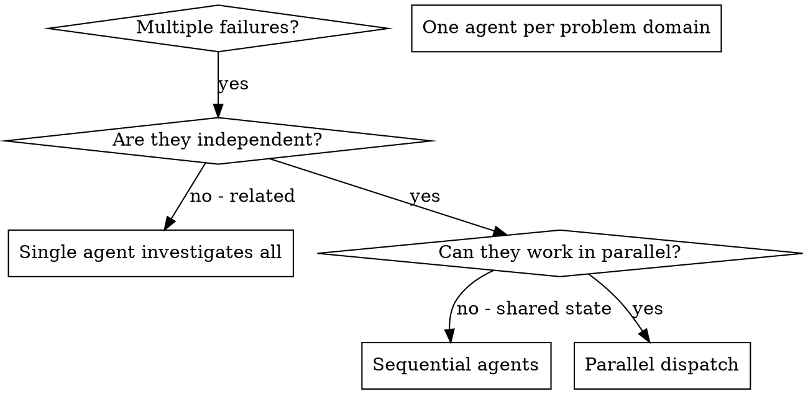

# Dispatching Parallel Agents

## Overview

You delegate tasks to specialized agents with isolated context and, when they edit files, isolated Jujutsu workspaces. By precisely crafting their instructions and context, you ensure they stay focused and succeed at their task. They should never inherit your session's context or history — you construct exactly what they need. This also preserves your own context for coordination work.

When you have multiple unrelated failures (different test files, different subsystems, different bugs), investigating them sequentially wastes time. Each investigation is independent and can happen in parallel.

**Core principle:** Dispatch one agent per independent problem domain. Let them work concurrently.

## When to Use



**Use when:**
- 3+ test files failing with different root causes
- Multiple subsystems broken independently
- Each problem can be understood without context from others
- No shared state between investigations

**Don't use when:**
- Failures are related (fix one might fix others)
- Need to understand full system state
- Agents would interfere through the same external resources

## The Pattern

### 1. Identify Independent Domains

Group failures by what's broken:
- File A tests: Tool approval flow
- File B tests: Batch completion behavior
- File C tests: Abort functionality

Each domain is independent - fixing tool approval doesn't affect abort tests.

### 2. Create Focused Agent Tasks

Each agent gets:
- **Specific scope:** One test file or subsystem
- **Clear goal:** Make these tests pass
- **Constraints:** Don't change other code
- **Workspace:** Its isolated working directory
- **Expected output:** Summary of what you found and fixed, plus its Jujutsu change ID

### 3. Dispatch in Parallel

When agents will edit files in a Jujutsu repository, give each agent a workspace. First choose the temporary base directory. Use `$(jj workspace root)/.tmp` inside a Jujutsu workspace and the local `.tmp` directory when `jj workspace root` fails:

```sh
if workspace_root=$(jj workspace root 2>/dev/null); then
  workspace_base="$workspace_root/.tmp"
else
  workspace_base=.tmp
fi
mkdir -p "$workspace_base"
```

Before creating anything under a workspace root, verify its root ignore rules
exclude `.tmp/`; stop and add that root ignore rule first if they do not. Choose
`SESSION_NAMESPACE` from the user, harness, or session instructions, and verify
the resulting repository-wide names with `jj workspace list`.

Create one workspace per independent domain, with each new working-copy change based on the current change:

```sh
jj workspace add --name "$SESSION_NAMESPACE-agent-abort" -r @ "$workspace_base/$SESSION_NAMESPACE-agent-abort"
jj workspace add --name "$SESSION_NAMESPACE-agent-batch" -r @ "$workspace_base/$SESSION_NAMESPACE-agent-batch"
jj workspace add --name "$SESSION_NAMESPACE-agent-approval" -r @ "$workspace_base/$SESSION_NAMESPACE-agent-approval"
```

`-r @` makes each workspace's working-copy change a child of the same starting change. Give each agent its workspace path and require it to stay there. Outside a Jujutsu repository, use separate directories under the local `.tmp` fallback if the environment can provide isolated copies; otherwise dispatch only non-editing investigations or tasks whose file scopes cannot overlap.

Issue all three subagent dispatches in the same response — they run in parallel:

```text
Subagent (general-purpose): "In workspace <agent-abort-path>, fix agent-tool-abort.test.ts failures"
Subagent (general-purpose): "In workspace <agent-batch-path>, fix batch-completion-behavior.test.ts failures"
Subagent (general-purpose): "In workspace <agent-approval-path>, fix tool-approval-race-conditions.test.ts failures"
# All three run concurrently.
```

Multiple dispatch calls in one response = parallel execution. One per response = sequential.

### 4. Review and Integrate

When agents return:
- Read each summary
- Inspect each returned change with `jj show <change-id>`
- Verify the changes don't overlap or conflict
- Integrate the changes with `jj new <change-id>...`, which creates a merge change with all agent changes as parents
- Run `jj status` and resolve any conflicts in the merge change
- Run full test suite
- Forget each temporary workspace with `jj workspace forget <workspace-name>`, then delete its directory

## Agent Prompt Structure

Good agent prompts are:
1. **Focused** - One clear problem domain
2. **Self-contained** - All context needed to understand the problem
3. **Specific about output** - What should the agent return?

```markdown
Fix the 3 failing tests in src/agents/agent-tool-abort.test.ts:

1. "should abort tool with partial output capture" - expects 'interrupted at' in message
2. "should handle mixed completed and aborted tools" - fast tool aborted instead of completed
3. "should properly track pendingToolCount" - expects 3 results but gets 0

These are timing/race condition issues. Your task:

1. Read the test file and understand what each test verifies
2. Identify root cause - timing issues or actual bugs?
3. Fix by:
   - Replacing arbitrary timeouts with event-based waiting
   - Fixing bugs in abort implementation if found
   - Adjusting test expectations if testing changed behavior

Do NOT just increase timeouts - find the real issue.

Before returning, inspect `jj diff` and use `jj describe` to describe the working-copy change. Repository-local conventions take precedence; do not impose a fixed prefix, layout, or syntax. Based on https://go.dev/wiki/CommitMessage and on past commit messages that you can see in `git log`, compose commit messages adherent to the present standards.

Return: Summary of what you found and what you fixed, plus the change ID from `jj log -r @ --no-graph -T 'change_id ++ "\n"'`.
```

## Common Mistakes

**❌ Too broad:** "Fix all the tests" - agent gets lost
**✅ Specific:** "Fix agent-tool-abort.test.ts" - focused scope

**❌ No context:** "Fix the race condition" - agent doesn't know where
**✅ Context:** Paste the error messages and test names

**❌ No constraints:** Agent might refactor everything or leave its assigned workspace
**✅ Constraints:** "Do NOT change production code," "Fix tests only," and "Work only in the assigned workspace"

**❌ Vague output:** "Fix it" - you don't know what changed
**✅ Specific:** "Return summary of root cause and changes, plus the Jujutsu change ID"

## When NOT to Use

**Related failures:** Fixing one might fix others - investigate together first
**Need full context:** Understanding requires seeing entire system
**Exploratory debugging:** You don't know what's broken yet
**Shared state:** Agents would interfere through the same external resources; isolate file edits with Jujutsu workspaces

## Real Example from Session

**Scenario:** 6 test failures across 3 files after major refactoring

**Failures:**
- agent-tool-abort.test.ts: 3 failures (timing issues)
- batch-completion-behavior.test.ts: 2 failures (tools not executing)
- tool-approval-race-conditions.test.ts: 1 failure (execution count = 0)

**Decision:** Independent domains - abort logic separate from batch completion separate from race conditions

**Dispatch:**
```
Agent 1 → Fix agent-tool-abort.test.ts in its Jujutsu workspace
Agent 2 → Fix batch-completion-behavior.test.ts in its Jujutsu workspace
Agent 3 → Fix tool-approval-race-conditions.test.ts in its Jujutsu workspace
```

**Results:**
- Agent 1: Replaced timeouts with event-based waiting
- Agent 2: Fixed event structure bug (threadId in wrong place)
- Agent 3: Added wait for async tool execution to complete

**Integration:** Reviewed each change ID, created a merge change with all three as parents, found no conflicts, and ran the full suite successfully

## Verification

After agents return:
1. **Review each summary** - Understand what changed
2. **Inspect each change** - Use `jj show <change-id>` before integration
3. **Create the merge change** - Run `jj new <change-id>...`
4. **Check for conflicts** - Did agents edit the same code?
5. **Run full suite** - Verify all fixes work together
6. **Spot check** - Agents can make systematic errors
7. **Clean up workspaces** - Forget them with `jj workspace forget` and remove their directories
